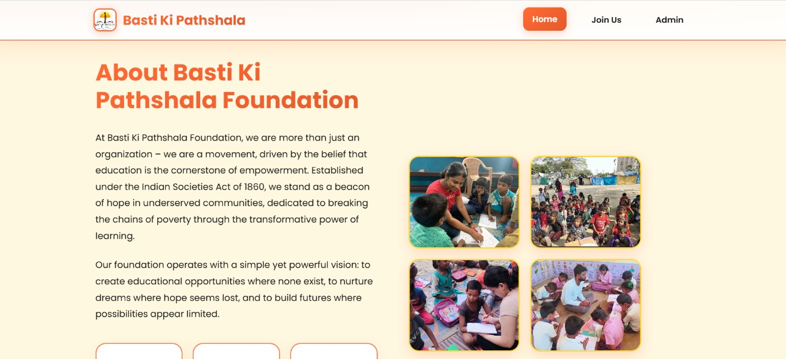

# Basti Ki Pathshala Foundation - Web Application


# [🚀 Live Site](https://ngo-foundation-project-1.onrender.com)


A modern web application for Basti Ki Pathshala Foundation to manage intern and volunteer applications. Built with React frontend and Node.js/Express backend.

## Features

- **Home Page**: Beautiful landing page showcasing the foundation's mission and values
- **Registration Form**: Comprehensive application form for interns and volunteers
- **Admin Dashboard**: Complete management system for reviewing and managing applications
- **File Upload**: Resume/CV upload functionality
- **Responsive Design**: Mobile-friendly interface
- **Modern UI**: Clean, professional design with smooth animations

## Screenshots

### Home Page


### Registration Form


### Admin Dashboard


### Search and Filter Functionality


### Application Details Modal


### Mobile Responsive Design


### Navigation and Layout


## Tech Stack

- **Frontend**: React.js with React Router
- **Backend**: Node.js with Express.js
- **File Upload**: Multer for handling file uploads
- **Styling**: Custom CSS with modern design principles
- **HTTP Client**: Axios for API communication

## Project Structure

```
basti-ki-pathshala/
├── client/                 # React frontend
│   ├── public/            # Static files
│   ├── src/               # React source code
│   │   ├── components/    # React components
│   │   ├── App.js         # Main app component
│   │   └── index.js       # Entry point
│   └── package.json       # Frontend dependencies
├── public/                # Backend static files
│   └── images/           # Uploaded images (create this folder)
├── server.js              # Express server
├── package.json           # Backend dependencies
└── README.md             # This file
```

## Installation & Setup

### Prerequisites

- Node.js (v14 or higher)
- npm or yarn

### Backend Setup

1. Install backend dependencies:
   ```bash
   npm install
   ```

2. Create the images folder for file uploads:
   ```bash
   mkdir -p public/images
   ```

3. Start the backend server:
   ```bash
   npm start
   # or for development with auto-restart:
   npm run dev
   ```

The backend will run on `http://localhost:5000`

### Frontend Setup

1. Navigate to the client directory:
   ```bash
   cd client
   ```

2. Install frontend dependencies:
   ```bash
   npm install
   ```

3. Start the React development server:
   ```bash
   npm start
   ```

The frontend will run on `http://localhost:3000`

## Usage

### For Applicants

1. Visit the home page to learn about the foundation
2. Click "Join Our Team" or navigate to the registration form
3. Fill out the comprehensive application form
4. Upload your resume/CV (optional)
5. Submit your application

### For Administrators

1. Navigate to the Admin page (`/admin`)
2. View all submitted applications
3. Use search and filter options to find specific applications
4. Click "View Details" to see full application information
5. Update application status (Pending, Contacted, Approved, Rejected)
6. Download/view uploaded resumes

## API Endpoints

- `GET /api/applicants` - Get all applicants
- `POST /api/register` - Submit new application
- `PUT /api/applicants/:id/status` - Update application status

## File Upload

- Supported formats: PDF, DOC, DOCX
- Maximum file size: 5MB
- Files are stored in `public/images/` directory

## Customization

### Adding Images

1. Place your foundation logo and other images in the `public/images/` folder
2. Update the image references in the Home component
3. The placeholder in the about section can be replaced with your actual logo

### Styling

- Colors are defined in CSS variables in `client/src/index.css`
- Primary color: `#ff6b35` (Orange)
- Secondary color: `#f7931e` (Orange)
- Accent color: `#ffd23f` (Yellow)

### Content

- Update the foundation's description in the Home component
- Modify form fields in the Registration component
- Customize admin dashboard features in the Admin component

## Deployment

### Development

Run both backend and frontend simultaneously:
```bash
# Terminal 1 - Backend
npm start

# Terminal 2 - Frontend
cd client && npm start
```

### Production

1. Build the React app:
   ```bash
   cd client && npm run build
   ```

2. Set environment variable:
   ```bash
   export NODE_ENV=production
   ```

3. Start the production server:
   ```bash
   npm start
   ```

## Features in Detail

### Home Page
- Hero section with call-to-action
- About section with foundation information
- Mission and values showcase
- Statistics display
- Footer with contact information

### Registration Form
- Personal information fields
- Position selection
- Education and experience details
- Skills and motivation sections
- Availability information
- Resume upload functionality
- Form validation and error handling

### Admin Dashboard
- Overview of all applications
- Search and filter functionality
- Status management (Pending, Contacted, Approved, Rejected)
- Detailed view modal for each application
- Statistics display
- Responsive design for mobile devices

## Contributing

1. Fork the repository
2. Create a feature branch
3. Make your changes
4. Test thoroughly
5. Submit a pull request

## License

This project is licensed under the MIT License.

## Contact

For questions or support, contact:
- Email: info@bastikipathshala.org
- Website: www.bastikipathshala.org

---

**Basti Ki Pathshala Foundation** - Where learning knows no boundaries 